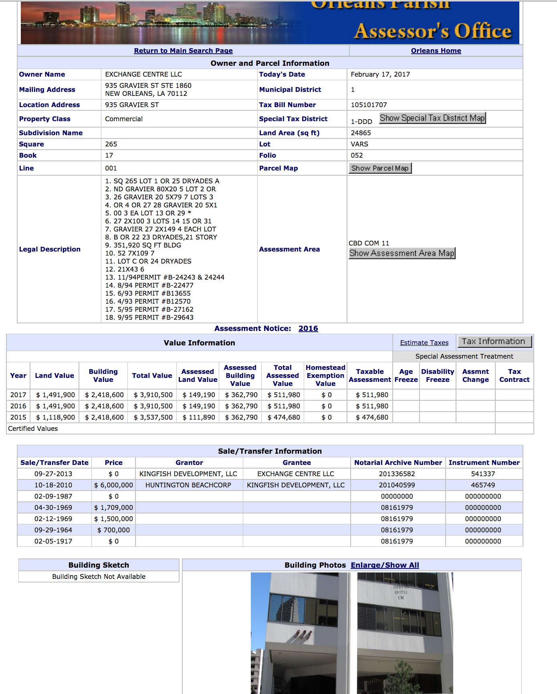

# NOLA Tax Assessor Data

This is a DataSource containing tax data on ~160,000 properties in New Orleans. I heard the assessor's office was unwilling
to share the data with the city's open data initiative so I'm releasing it here.  I've scraped this data from the [tax assessor's web site](http://nolaassessor.com/).

[Here](http://qpublic9.qpublic.net/la_orleans_display.php?KEY=935-GRAVIERST) is an example page of a single property.

## Tables

* `assessor.properties`
* `assessor.property_sales`
* `assessor.property_values`
